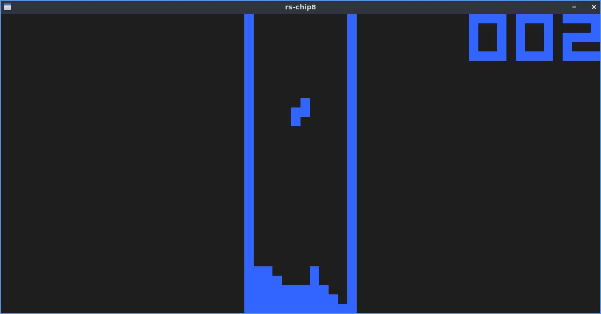

# rs-chip8
Chip-8 emulator programmed in Rust using SDL. It includes keyboard input and sound output. Using the arguments it is possible to change the default foreground and background colors.
.             |  .
:-------------------------:|:-------------------------:
|

# Usage
Cargo must be installed to be able to compile the emulator
```shell
# cargo run ./roms/pong.ch8 3
```
If you want to change the default black and white look of the emulator it is possible to also provide arguments for the colors in RGB format with no delimitators
```shell
# cargo run ./roms/pong.ch8 3 255 100 100           // Changes foreground color
# cargo run ./roms/pong.ch8 3 255 100 100 0 0 100   // Changes foreground and background color
```

# Dependencies
- rand
- sdl2
- sdl2.gfx
